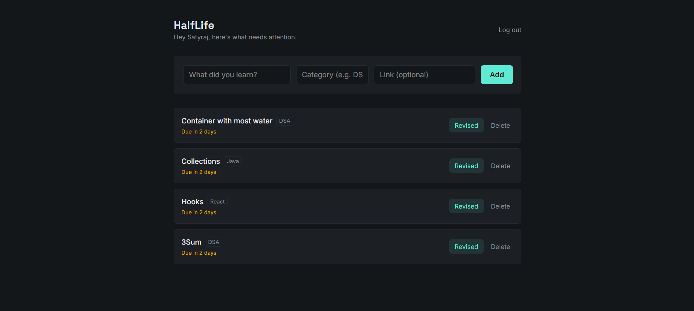
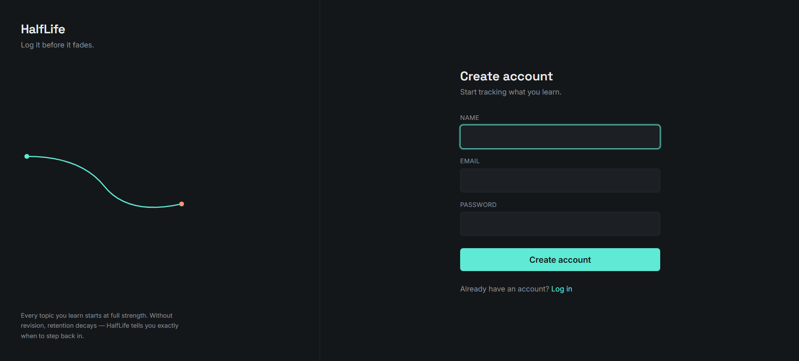
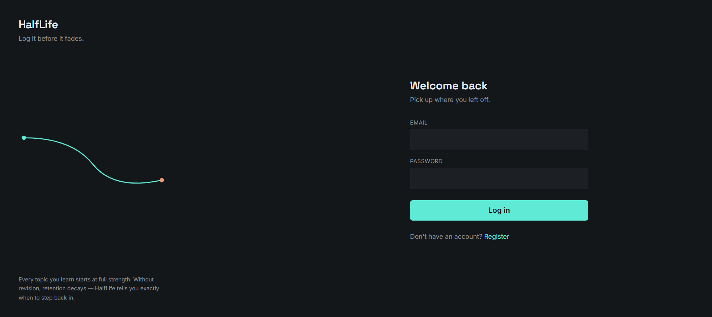

# HalfLife

A spaced-repetition learning tracker. Log what you've learned, and HalfLife tells you exactly when it's about to fade from memory — so you can revise it before it does.

**Live demo:** https://shmadake-half-life.vercel.app

## Features

- User authentication (register/login) with hashed passwords and JWT-based sessions
- Log topics you've learned, tagged with a category (e.g. DSA, Java, React) and an optional resource link
- Automatic spaced-repetition scheduling — every topic shows exactly when it's due for revision
- Mark a topic as "Revised" to reschedule its next review interval
- Delete topics you no longer need to track
- Clean, minimal dark-mode UI built with Tailwind CSS
- Friendly, actionable error handling (e.g. attempting to register an existing account links straight to login)

## Tech Stack

**Frontend:** React 19, React Router v7, Tailwind CSS v4, Axios, Vite
**Backend:** Java 21, Spring Boot 4.1 (Web, Data JPA, Security)
**Database:** PostgreSQL (hosted on Neon)
**Auth:** JWT (jjwt), BCrypt password hashing
**Deployment:** Render (backend, Docker), Vercel (frontend)

## Screenshots

**Dashboard**


**Register**


**Login**


## Getting Started

### Prerequisites
- Java 21 and Maven (or use the included `./mvnw` wrapper)
- Node.js 18+
- A PostgreSQL database (local or hosted, e.g. Neon)

### Backend setup

Clone the repo:
```bash
git clone https://github.com/shmadake/half-life.git
cd half-life
```

Run it:
```bash
./mvnw spring-boot:run
```
The API will be available at `http://localhost:8080`.

### Frontend setup

Clone the repo:
```bash
git clone https://github.com/shmadake/half-life-frontend.git
cd half-life-frontend
npm install
```

Copy `.env.example` to `.env` and point it at your backend:
```
VITE_API_URL=http://localhost:8080/api
```

Run the dev server:
```bash
npm run dev
```
Open `http://localhost:5173`.

### Environment Variables (backend)

| Variable | Default (local dev) | Description |
|---|---|---|
| `DB_URL` | `jdbc:postgresql://localhost:5433/half_life_db` | JDBC connection string |
| `DB_USERNAME` | `postgres` | Database username |
| `DB_PASSWORD` | `root` | Database password |
| `DDL_AUTO` | `update` | Hibernate schema strategy |
| `JWT_SECRET` | *(dev fallback only)* | Secret key used to sign JWTs — generate a real one with `openssl rand -hex 32` |
| `JWT_EXPIRATION` | `86400000` (24h) | JWT expiry, in milliseconds |
| `CORS_ALLOWED_ORIGINS` | `http://localhost:5173` | Comma-separated list of allowed frontend origins |
| `PORT` | `8080` | Server port |

### Building for production

Backend (Docker):
```bash
docker build -t half-life-backend .
```

Frontend:
```bash
npm run build
```
Outputs a static production build to `dist/`.

## API Overview

| Method | Endpoint | Auth required | Description |
|---|---|---|---|
| POST | `/api/auth/register` | No | Register a new account |
| POST | `/api/auth/login` | No | Log in, returns a JWT |
| GET | `/api/topics` | Yes | Get all topics for the logged-in user |
| POST | `/api/topics` | Yes | Create a new topic |
| PUT | `/api/topics/{id}/revise` | Yes (owner only) | Mark a topic as revised |
| DELETE | `/api/topics/{id}` | Yes (owner only) | Delete a topic |

## Security Notes

- Passwords are hashed with BCrypt before storage — plaintext passwords are never saved
- Auth is stateless via JWT, verified on every request by a custom security filter
- All topic operations are scoped to the authenticated user's ID, resolved server-side from the JWT — not from any client-supplied identifier
- CORS is restricted to explicitly allowed origins via environment configuration, not left open with a wildcard

## Future Improvements

- Editable topics (currently create/revise/delete only, no update-in-place)
- Reminder notifications when a topic becomes due
- Search and filtering by category
- Refresh tokens (current JWTs simply expire after 24h with no renewal flow)

## License

Personal project — no license specified.
